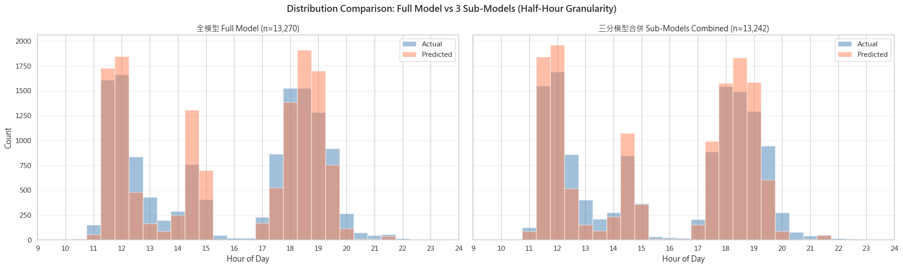
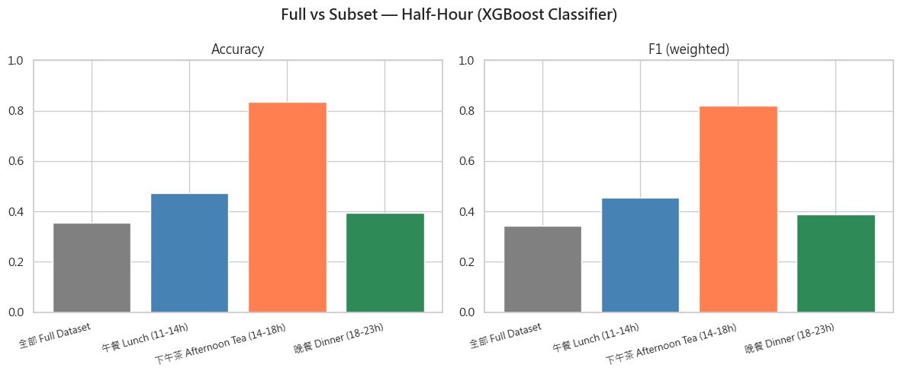
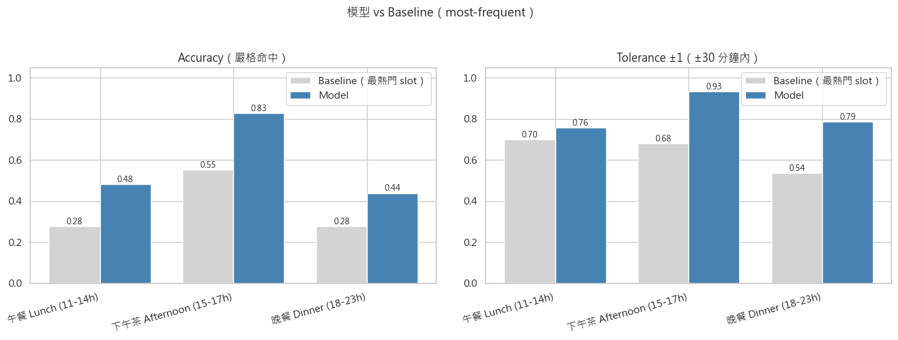

# RestaurantBookings

> <!-- TODO: 一句話描述這個專案（例如：「預測餐廳訂位是否會回流的機器學習專案」） -->

---

## 專案目的

本專案透過使用訂位平台上的訂位資料，使用xgboost演算法，預測顧客最有可能的用餐時段。使用資料來自[kaggle-Predict Repeat Restaurant Bookings](https://www.kaggle.com/competitions/predict-repeat-restaurant-bookings/overview)

本專案是取得客戶資料前驗證構想的Lab，動機來自餐飲業的真實需求。我們希望能夠為客戶設計一個推薦系統，為顧客推薦用餐時間。預設情境是當顧客遇到原先想要預定的用餐時段沒有空位之後，串接系統的AIAgent可以根據這個推薦模型找出最適合的時段推薦給他。

## 說明

我們將客戶實際的入座時間，依據每半小時切成不同用餐時段—因此模型變成一個分類預測問題，並利用各種呈現於資料中的客戶屬性預測用餐時間。

本模型開發中的主要困難，在於客戶集中分布於中餐時間與晚餐時間，若將資料一概而論進行訓練，絕大多數都預測在下午時段，即中餐與晚餐之間，與我們要精確預測客戶用餐時間的目的有別。本模型因此拆分為三個小模型，即分別對中餐、下午、晚餐時段的資料進行訓練。由於實際需求是為客人推薦用餐時段，判斷客人是用午餐、下午茶還是晚餐的任務應可事先判斷。



- 全資料模型與三分模型預測比較圖



- 從圖片中可以得知，將資料切分成三個子模型集大提升的Accuracy和F1-score。

我們的結果發現，對於下午時段(2點到6點)的預測最為準確，午餐和晚餐的預測則有待加強。模型在三個時段都高估尖峰時段的來客數，推測與不均衡樣本資料的特性有關，模型傾向將預測結果向眾數靠攏所致。

為了瞭解上述現象，我們考慮一個dummy model作為Baseline，用資料所知該時段最熱門的時段，作為預測值。譬如，已知客戶在下午茶時段(13點至17點)訂位，即以該時段最熱門時間14點半作為推薦值，而不理會餐廳或客戶屬性。



- 上圖顯示我們的模型與Baseline模型的比較。可以發現模型確實有所增強。

Baseline模型讓我們了解到，下午茶模型表現較好的原因，其實是因為下午茶時段的預測選項也比其他選項還要來得少，單單只是用最熱門時段預測，也會獲得較高的準確度。
另一方面，與Baseline模型比較後，我們也可以了解到，模型確實利用了餐廳與客戶資料，提升了準度，而非僅是就該時段猜測偏好訂位時段。

---

## 專案架構

```
RestaurantBookings/
├── configs/                     # 設定檔
│   ├── etl.yaml                 #   ETL 資料來源(Kaggle) + 各階段資料夾
│   ├── raw_data_schema.yaml     #   原始資料欄位 schema
│   ├── regression.yaml          #   Regression 超參數設定
│   ├── random_forest.yaml       #   Random Forest 超參數設定
│   └── xgboost.yaml             #   XGBoost 超參數設定
│
├── data/                        # 資料（透過 Git LFS 管理）
│   ├── raw/                     #   原始資料集
│   ├── interim/                 #   清理 / 整合後的中間資料
│   └── processed/
│       └── features_ready.csv   #   所有模型共用的起點
│
├── src/
│   ├── etl/                     # 領域知識 / 特徵工程（依編號順序執行）
│   │   ├── step0_run_download.py
│   │   ├── step1_run_cleaning.py
│   │   ├── step2_run_integration.py
│   │   ├── step3_run_features.py
│   │   ├── _config.py           # 讀取 configs/etl.yaml（路徑錨定專案根目錄）
│   │   └── _utils.py            # 共用工具（清洗/整合/特徵）
│   │
│   ├── common/                  # 共用建模工具（exploration 與 xgboost 共用）
│   │   └── model_utils.py       #   MLflow logging、CV、Optuna、繪圖、run 探索
│   │
│   ├── exploration/             # 【已凍結】初期多模型比較研究（見其 README）
│   │   ├── preprocessing/       #   各模型前處理（common / regression / tree）
│   │   ├── train_regression.py  #   已被 src/xgboost/ 取代，不再擴充
│   │   ├── train_random_forest.py
│   │   ├── train_xgboost.py
│   │   └── inference.py
│   │
│   └── xgboost/                 # 【source of truth】選定並產品化的模型
│       ├── preprocessing.py     #   自包含的編碼 / 縮放
│       ├── train.py             #   訓練 + MLflow logging
│       └── inference.py         #   推論
│
├── deployment/                  # 模型部署 (MLflow serving)
│   ├── conda.yaml               #   推論環境
│   ├── score.py                 #   推論入口
│   ├── schemas.py               #   I/O Pydantic schema
│   ├── example_input.json
│   └── test_score.py
│
├── notebooks/                   # 探索性分析與實驗
├── docs/                        # 文件與 API collection
└── mlruns/                      # MLflow tracking（本地、不入 git）
```

## 資料流

```
kaggle ──► step0_run_download ──► raw/ ──► step1_run_cleaning ──► interim/ ──► step2_run_integration ──► step3_run_features ──► processed/features_ready.csv
                                                                                       │
                                                                                       ▼
                                                          xgboost/preprocessing.py
                                                                                       │
                                                                                       ▼
                                                              xgboost/train.py ──► MLflow
                                                                                       │
                                                                                       ▼
                                                                            deployment/score.py
```

## 設計原則

- **ETL**：只做領域知識特徵工程，**不做** 模型專屬編碼
- **Preprocessing**：模型專屬轉換（regression 走 one-hot；tree-based 走 label / 保留整數）
- **Training**：每個模型腳本自行呼叫對應 preprocessing 並負責 MLflow logging

---

## 環境需求

- Python `>= 3.12`
- [uv](https://docs.astral.sh/uv/)（套件管理）
- [Git LFS](https://git-lfs.com/)（資料檔案需透過 LFS 拉取）

主要相依套件：`pandas`、`scikit-learn`、`xgboost`、`mlflow`、`optuna`、`pydantic`、`ydata-profiling`

## 安裝

```bash
# 1. clone 並拉取 LFS 資料
git clone https://github.com/TaiweiCiou1102/RestaurantBookings.git
cd RestaurantBookings
git lfs pull

# 2. 建立虛擬環境並安裝相依
uv sync
```

## 使用方式

### 資料下載

本專案資料使用kaggle公開競賽資料

### 跑 ETL 產生特徵

```bash
uv run python -m src.etl.step0_run_download     # 從 Kaggle 下載原始資料（--force 可強制重抓）
uv run python -m src.etl.step1_run_cleaning
uv run python -m src.etl.step2_run_integration
uv run python -m src.etl.step3_run_features
```

### 訓練模型

選定的 XGBoost（source of truth）：

```bash
uv run python -m src.xgboost.train --granularity hour
uv run python -m src.xgboost.train --granularity half_hour --tune
```

> 初期多模型比較（regression / random forest / xgboost）已凍結在 `src/exploration/`，
> 僅供重現比較結果，不再維護。

### 查看 MLflow 實驗結果

```bash
uv run mlflow ui
# 預設開在 http://127.0.0.1:5000
```

### 模型推論 / 部署

<!-- TODO: 補充部署方式
例如：
- MLflow Model Serving 啟動指令
- API endpoint 規格
- 範例請求 / 回應（可參考 docs/RestaurantBooking.postman_collection.json）
-->

---

## 實驗追蹤

本專案使用 **MLflow** 追蹤實驗。所有訓練腳本會自動記錄：

- 超參數（從 `configs/*.yaml` 讀取）
- 評估指標
- 模型 artifact
- 訓練資料指紋

預設追蹤資料寫入本地 `mlruns/`（已在 `.gitignore`，不入庫）。

---

## 資料來源

來自 Kaggle 競賽 **[Predict Repeat Restaurant Bookings](https://www.kaggle.com/competitions/predict-repeat-restaurant-bookings)**。

原始資料包含三類資料表，存放於 [`data/raw/`](data/raw/)：

| 檔案                                        | 內容                                             |
| ------------------------------------------- | ------------------------------------------------ |
| `member.csv`                                | 會員主檔（會員等級、年齡、性別、加入日期等屬性） |
| `restaurant.txt` / `restaurant_revised.csv` | 餐廳基本資訊                                     |
| `train.csv` / `train.txt`                   | 訓練集訂位紀錄（含實際入座時間）                 |
| `test.csv` / `test.txt`                     | 測試集訂位紀錄                                   |

ETL 流程會將三張表 join 起來、衍生領域知識特徵（會員行為、餐廳熱門時段、節慶接近度等），輸出到 [`data/processed/features_ready.csv`](data/processed/features_ready.csv) 供所有模型共用。

## 模型表現

以 **`reservation_half_hour` (0-47 半小時 slot)** 為預測目標。所有模型使用相同的 `features_ready.csv` 與 train/test split。

### 1. XGBoost Classifier（原始方法）

把 48 個半小時 slot 視為獨立類別。

| 模型             | 樣本數 (Test) |  Accuracy | F1 (weighted) |
| ---------------- | ------------: | --------: | ------------: |
| 全模型           |        13,270 |     0.356 |         0.342 |
| **三分模型合併** |        13,242 | **0.481** |     **0.467** |

子模型分項表現：

| 子模型                 | 樣本數 |  Accuracy |        F1 |
| ---------------------- | -----: | --------: | --------: |
| Lunch (11-14h)         |  5,955 |     0.472 |     0.454 |
| **Afternoon (15-17h)** |  1,533 | **0.834** | **0.820** |
| Dinner (18-23h)        |  5,754 |     0.395 |     0.387 |

### 2. XGBoost Regressor — Ordinal Regression（改善方案 C）

把 slot 當成連續數值，用 `objective="reg:absoluteerror"` (MAE) 訓練，預測完 round 回整數。優點：鄰近時段錯誤 = 小錯，避免分類器塌縮到單一尖峰時段。

| 模型             |  Accuracy | MAE (slots, 1 slot ≈ 30 min) | Acc ±1 slot (±30 min) | Acc ±2 slot (±1 hr) |
| ---------------- | --------: | ---------------------------: | --------------------: | ------------------: |
| 全模型           |     0.196 |                         3.03 |                 0.454 |               0.593 |
| **三分模型合併** | **0.397** |                     **1.01** |             **0.780** |           **0.898** |

子模型分項表現：

| 子模型                 |  Accuracy | MAE (slots) | Acc ±1 slot | Acc ±2 slot |
| ---------------------- | --------: | ----------: | ----------: | ----------: |
| Lunch (11-14h)         |     0.331 |        1.23 |       0.721 |       0.841 |
| **Afternoon (15-17h)** | **0.797** |    **0.44** |   **0.909** |   **0.937** |
| Dinner (18-23h)        |     0.357 |        0.94 |       0.807 |       0.947 |

### 結論

- **三分模型在兩種建模方式下皆優於全模型**——以 Regressor 為例，accuracy 從 19.6% 翻倍到 39.7%、MAE 從 3.03 slot (~90 min) 收斂到 1.01 slot (~30 min)。
- **Afternoon 時段（15-17h）最容易預測**——Regressor 在子集上達到 ±1 小時內 94% 命中率，跟資料分布相對均勻、樣本數較少但類別簡單有關。
- **若實際情境是「推薦時段」**（README 開頭情境），Regressor 的 ±1 slot / ±2 slot 命中率更貼近商業價值——容差 ±30 分鐘已能覆蓋近 8 成的客人。
- 詳細分析、分布直方圖、改善方案討論請見 [notebooks/xgboost.ipynb](notebooks/xgboost.ipynb)。

---
